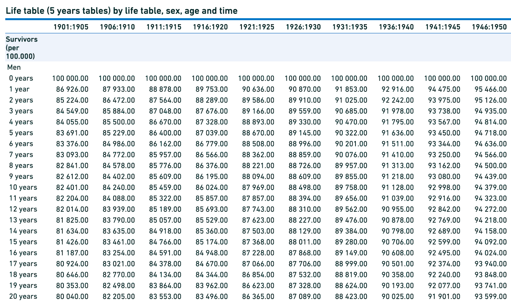
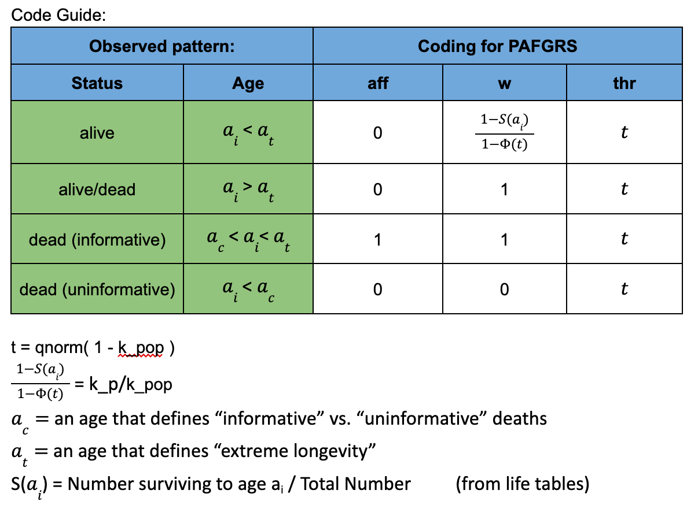
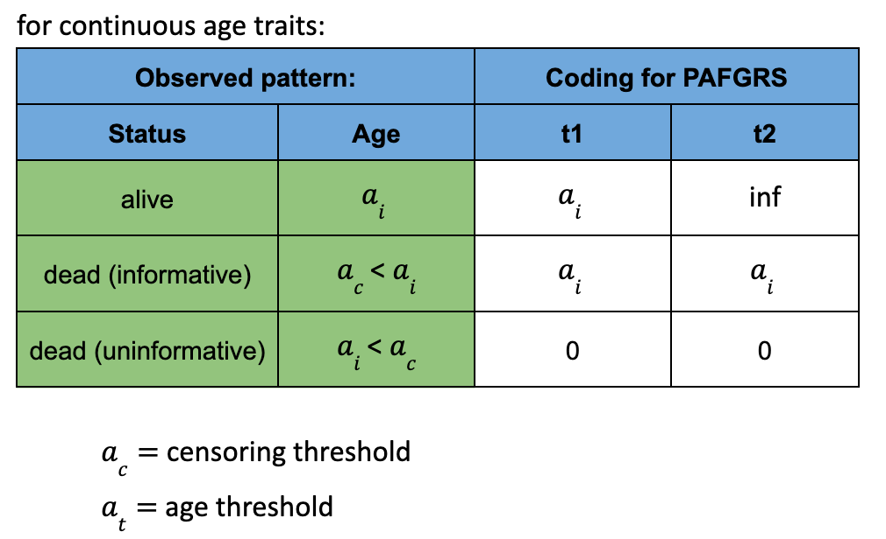

# PA-FGLS

## Comprehensive Guide
For those who wish to delve deeper and regenerate the vignette, the requisite code is provided below. Please execute this in your R environment for the desired output.

``` r
# Make sure to clone this repository
git clone git@github.com:BioPsyk/PAFGLS.git

# Enter the cloned repository
cd PAFGLS/PAFGLS-master

# Start R and run
library(devtools)
load_all()
build_vignettes()
```

The vignette in the format .html, .R and .RMD can now be found in the `doc` folder. 

## Containers
For the ability to run PAFGLS in places where new installations are not possible we provide a container image using docker and singularity. First use Docker to build a docker image on a machine where you have root access. Then use singularit to convert the docker image to a singularity image, which is a file that easily can be moved and copied. 

### Singularity at HPC:s
Sometimes it is already installed and you do not need to install it, and sometimes you are only allowed to run singularities in interactive jobs or batch jobs. And sometimes you need to load a module, see example below:

```
# To load singularity on HPC:s with module systems
module load tools
module load singularity/4.0.0
```

### Download and enter the container
The container can be downloaded from dockerhub, and ad-hoc converted to a singularity .sif image. Then you just have to enter the image, load the correct libraries. Remember to mount a parent folder that contains all input data needed for PAFGLS.
```
# Get singularity from dockerhub
mkdir -p tmp
singularity pull tmp/ibp-pafgrs-base_version-1.0.0.sif docker://biopsyk/ibp-pafgrs:1.0.0

# set folder to mount, e.g., your home folder
folder_to_mount=${HOME}

# Run the image starting R directly, mounted data accessible in /data inside the image.
./scripts/singularity-run.sh

```
PAFGLS is now loaded and ready in the interactive R session

### Re-build the container
When changing the Dockerfile, the docker and singularity images need to be rebuild. This is how you can do it locally. Requires docker and singularity to be installed.
```
# Build docker image
./scripts/docker-build.sh
# Convert to Singularity image
./scripts/singularity-build.sh
```
## Running PAFGLS
For running PAFGLS, there is the option to either run longvity as a continouous or a binary trait. It is also possible to include an age censoring threshold, in which the individuals who have died before the specified threshold, will be censored. 

Data files needed for both binary and continuous traits of longevity:
1. Kinship matrix - data structure on how related individuals are in your data sample. Will be a three column dataframe, that includes ID1 (id number of relative 1), ID2 (id number of relative 2), and relatedness (the rate of relatedness between the relative 1 and 2).
2. Lifetable - When computing the phenotype dataframe, it is good to use a lifetable that describes the life expactancy for the population, stratified by birthyear and sex. 

CI curves are downloaded from: https://statbank.dk/statbank5a/default.asp?w=1792
Goes from ages 0-99, with the columns representing birth cohorts. 


### Binary longevity trait
Firstly, you have to decided the value for some variables for the phenotype defintion:
1. Age threshold - that defines which value should divided cases and controls. Ex. 90 yrs old
2. Censoring threshold - the individuals who died prior to this threshold will be censored in analysis (if you do not wish to include censoring, you set this variable to zero). Ex. 5 yrs old, meaning deaths occuring prior to 5 yrs old will be censored in analysis.
3. heritability - input an estimate of heritability of the measured trait. Ex. 0.5, meaning 50%  

Using these variables you will compute a phenotype dataframe that includes the columns: id, aff, k_p, k_pop, thr, w.
1. id = the identification number of the relative.
2. aff = the affektiv status of the relative as a binary variable, 0 or 1. The phenotype is reversed for computational purposes so aff = 1 if relative's age is below the age threshold, and aff = 0 if relative's age is above the age threshold.
3. k_p = a metric from 0 - 1 that describes each individuals accumulated risk for the event (death), as determined by the lifetable.
4. k_pop = a metrics from 0 - 1 that describes the population risk of event (death), given the age threshold, as determined by the lifetable.
5. thr = qnorm(1-k_pop), which is the threshold that will be used for each relative.
6. w = k_p/k_pop, the proportion of risk experienced by each relative.



Four add-on rules apply for the w variable:
1. If a relative is considered a case - set w = 1.
2. If w > 1, then set w = 1.
3. If individual is dead or alive above the age threshold then w = 1.
4. If you wish to censor an individual, w = 0 and aff = 0. The combination is registered as an NA by the algorithm.

Additionally you will supply the wrapper function with a list of you proband ids (not relatives, but the people you want the scor computed for), and you estimate of heritability (h2).

Your run the script by calling the following code, if we assume that our kinship matrix is called "K" and our phenotype dataframe is called "pheno":
```
output <- FGLS_wrapper_binary(proband_ids,K,pheno,method="PAFGRS",h2,w=pheno$w,thr=pheno$thr)
```

### Continuous longevity trait

Firstly, you have to decided the value for some variables for the phenotype definition:
1. Censoring threshold - the individuals who died prior to this threshold will be censored in analysis (if you do not wish to include censoring, you set this variable to zero). Ex. 5 yrs old, meaning deaths occuring prior to 5 yrs old will be censored in analysis.
2. heritability - input an estimate of heritability of the measured trait. Ex. 0.5, meaning 50% 

Using these variables you will compute a phenotype dataframe that includes the columns: id, aff, t1, t2
1. id = the identification number of the relative.
2. aff = dead or alive as a binary variable.
3. t1 = qnorm(k_p), and set any value of 0 to 0.001 and 1 to 0.999 (adding more decimals will create NAs; k_p = a metric from 0 - 1 that describes each individuals accumulated risk for the event (death), as determined by the lifetable)

We are using a two-threshold model ...



Additionally you will supply the wrapper function with a list of you proband ids (not relatives, but the people you want the score computed for), and you estimate of heritability (h2).

Your run the script by calling the following code, if we assume that our kinship matrix is called "K" and our phenotype dataframe is called "pheno":
```
output <- FGLS_wrapper_continuous(proband_ids,K,pheno,method="PAFGRS",h2,t1=pheno$t1)
```

### Output

For both analysis you will get an output dataframe that includes columns: id, postM, postVar, n_rels.
1. id = identification number of proband.
2. postM = posterior mean of score (?)
3. postVar = p
4. n_rels = number of relatives that the score was computed from for that proband.
